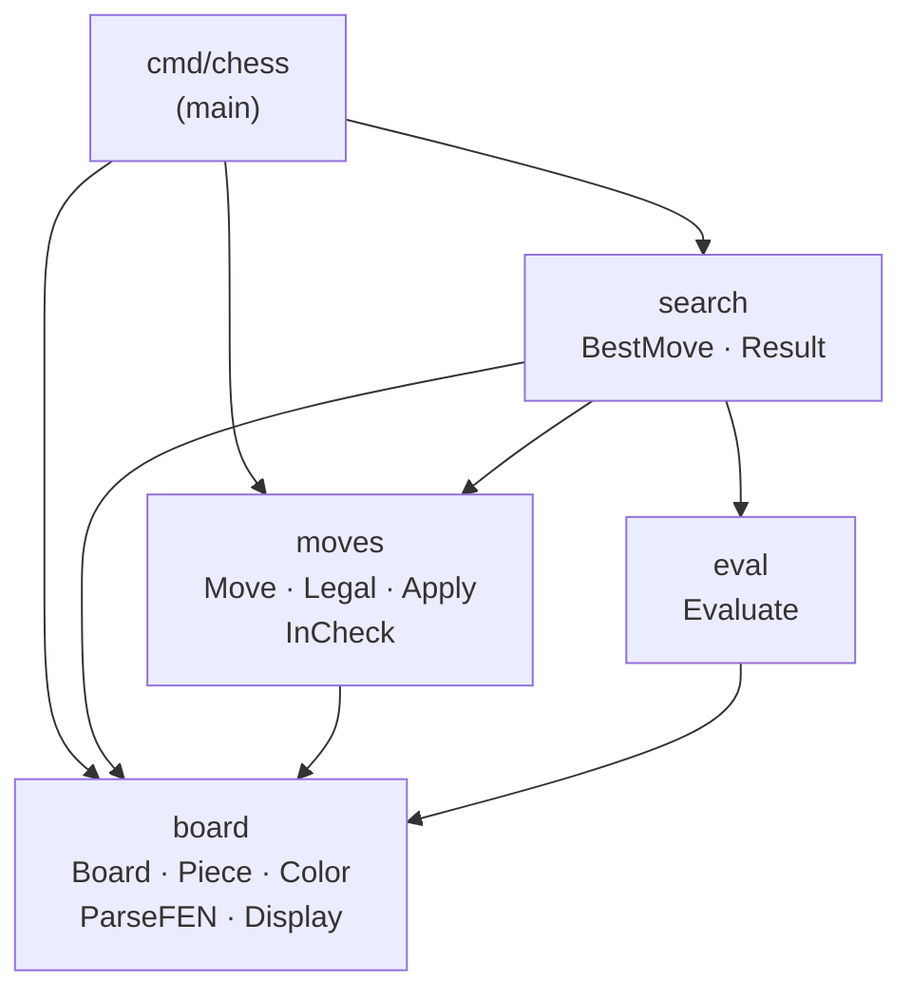
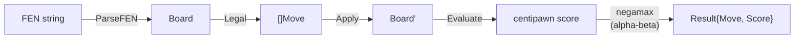

# Architecture

## Package Dependencies

## Core Data Flow

## Key Types

| Type     | Package  | Description                                                     |
| -------- | -------- | --------------------------------------------------------------- |
| `Board`  | `board`  | 64-square array + turn, castling rights, en passant, clocks     |
| `Piece`  | `board`  | `{Type PieceType, Color Color}`                                 |
| `Move`   | `moves`  | `{From, To int, Promotion PieceType}`                           |
| `Result` | `search` | `{Move Move, Score int}` — score from moving side's perspective |

## Score Convention

Scores are in **centipawns** from **White's perspective** (`Evaluate`).
Inside `negamax` they flip each ply — always from the side-to-move's perspective.
Positive = White better; negative = Black better.
